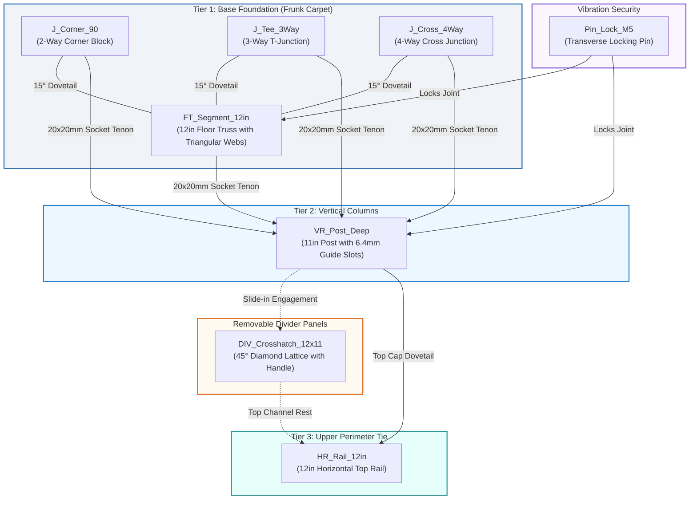
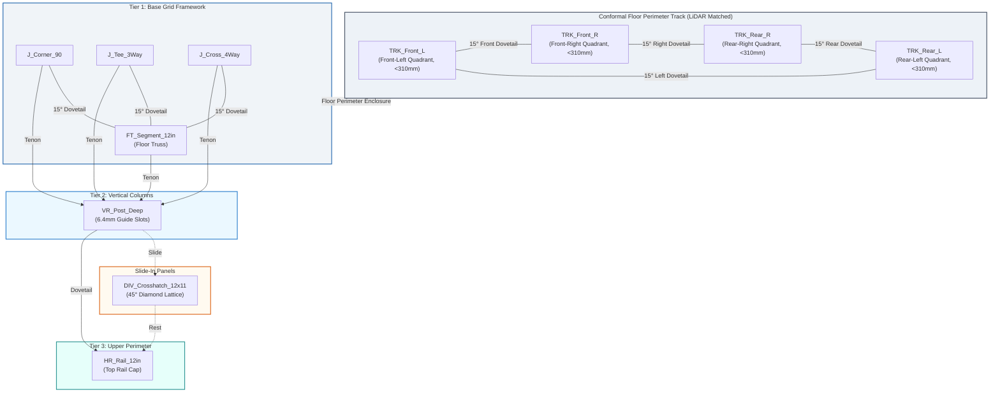

# Tesla Model X Frunk Modular Divider System
### Parametric CAD, 3D Printing & Assembly Architecture for Creality K2 Combo (350×350×350 mm)

[](https://www.autodesk.com/products/fusion-360)
[-blue.svg)](https://www.creality.com/)
[-red.svg)](https://www.tesla.com/modelx)
[](docs/3d_printing_and_slicing_guide.md)
[](tests/)
[](LICENSE)

---

## 1. Executive Summary & Project Overview

The **Tesla Model X Frunk Modular Divider System** is an open-source, production-grade automotive cargo management ecosystem engineered specifically for the deep front trunk (frunk) tub of the **2017 Tesla Model X (AWD configuration)**. 

Optimized for manufacturing on large-format, high-speed CoreXY 3D printers—specifically the **Creality K2 Combo / Plus** with its **350 × 350 × 350 mm** build volume and **60°C active heated chamber**—the system provides rigid, rattle-free compartmentalization for heavy charging cables (Tesla Mobile Connector, CCS adapters), portable tire inflators, roadside safety tools, groceries, and travel luggage.

```
+=============================================================================+
|                 TESLA MODEL X 2017 FRUNK DIVIDER SYSTEM HIGHLIGHTS          |
+=============================================================================+
|  Vehicle Compatibility:  2017 Tesla Model X (75D / 90D / 100D / P100D AWD)   |
|  Frunk Compartment:      Deep lower carpet tub (drop-in, zero vehicle mods)  |
|  Target 3D Printer:      Creality K2 Combo / Plus (350 × 350 × 350 mm)       |
|  CAD Automation Engine:  Autodesk Fusion 360 Python API (`fx` Parametric)    |
|  Standard Grid Pitch:    12.0 in (304.8 mm) Bay Spacing × 11.0 in (280.0 mm) |
|  Primary Material:       ASA (Acrylonitrile Styrene Acrylate) - UV & Heat 105°C|
|  Joint Mechanics:        15° Sliding Dovetails + Transverse M5 Pin Locks     |
|  Support-Free Printing:  45° Self-Supporting Diamond Lattice (0 supports)   |
+=============================================================================+
```

---

## 2. System Architecture & Component Library

The divider framework utilizes a **3-tier interlocking mechanical architecture** that eliminates fasteners, screws, and glues while providing maximum structural stiffness against longitudinal braking forces ($\le 1.2\text{ G}$) and lateral cornering loads ($\le 0.9\text{ G}$).

```
+=============================================================================+
|                      MODULAR 3-TIER SYSTEM ARCHITECTURE                     |
+=============================================================================+
|                                                                             |
|   [ Tier 3: Top Rails ]        ====== HR_Rail_12in ====== (Upper Tie Cap)   |
|                                         |           |                       |
|   [ Removable Dividers ]       [DIV_Crosshatch_12x11]  (45° Diamond Lattice)|
|                                         |           |                       |
|   [ Tier 2: Vertical Posts ]   |-- VR_Post_Deep --|  (6.4mm Guide Slots)    |
|                                 |                   |                       |
|   [ Tier 1: Floor Trusses ]    +-- FT_Segment_12in +  (Triangular Webs)     |
|                                 |                   |                       |
|   [ Modular Junctions ]      J_Corner_90 / J_Tee_3Way / J_Cross_4Way        |
|                                                                             |
|   [ Vibration Locks ]        Pin_Lock_M5 (Transverse Mechanical Dowels)     |
+=============================================================================+
```



### Component Details & Specifications

| Component Identifier | Functional Role | Nominal Dimensions ($L \times W \times H$) | Key Geometric Features |
| :--- | :--- | :--- | :--- |
| **`FT_Segment_12in`** | Floor Truss Beam | $304.8 \times 24.0 \times 35.0\text{ mm}$ | 6 triangular weight-reduction cutouts, +X male dovetail, -X female dovetail, center post socket, 5.0mm pin bore |
| **`VR_Post_Deep`** | Vertical Rib Post | $24.0 \times 24.0 \times 280.0\text{ mm}$ | Dual opposing 6.4mm guide slots (8mm deep), bottom 20×20mm tenon, 5.0mm cross pin hole, top rail locator |
| **`HR_Rail_12in`** | Horizontal Top Rail | $304.8 \times 24.0 \times 24.0\text{ mm}$ | Bottom 6.4mm channel with 45° chamfer lead-in funnel, end male/female dovetails for top perimeter rigidity |
| **`J_Corner_90`** | 2-Way Corner Block | $32.0 \times 32.0 \times 35.0\text{ mm}$ | Dual orthogonal 15° dovetail tabs, central 20×20mm post socket, transverse 5.0mm pin hole |
| **`J_Tee_3Way`** | 3-Way T-Junction | $32.0 \times 32.0 \times 35.0\text{ mm}$ | 3-way 15° dovetail tabs, central 20×20mm post socket, transverse 5.0mm pin hole |
| **`J_Cross_4Way`** | 4-Way Cross Junction | $32.0 \times 32.0 \times 35.0\text{ mm}$ | 4-way 15° dovetail tabs, central 20×20mm post socket, transverse 5.0mm pin hole |
| **`DIV_Crosshatch_12x11`** | Slide-In Divider Panel | $298.0 \times 275.0 \times 5.0\text{ mm}$ | 10.0mm solid perimeter rim, 45° self-supporting diamond lattice (18mm pitch, 3.5mm struts), 80×22mm pull handle |
| **`Pin_Lock_M5`** | Transverse Locking Pin | $\varnothing 8.0\text{ mm cap} \times 32.0\text{ mm}$ | 5.0mm nominal shaft with 1° lead-in taper and retention shoulder for road vibration security |
| **`TRK_Front_L`** | Conformal Track Front-Left | $282.4 \times 176.4 \times 18.0\text{ mm}$ | LiDAR floor perimeter matched ($0.50\text{ in}$ / $12.7\text{ mm}$ inset), $30 \times 18\text{ mm}$ rigid rectangular profile, captive sliding rail, 15° interlocking dovetail seam ends ($0.20\text{ mm}$ tolerance, $\le 310\text{ mm}$ bed limit) |
| **`TRK_Front_R`** | Conformal Track Front-Right | $282.4 \times 176.4 \times 18.0\text{ mm}$ | LiDAR floor perimeter matched ($0.50\text{ in}$ / $12.7\text{ mm}$ inset), $30 \times 18\text{ mm}$ rigid rectangular profile, captive sliding rail, 15° interlocking dovetail seam ends ($0.20\text{ mm}$ tolerance, $\le 310\text{ mm}$ bed limit) |
| **`TRK_Rear_L`** | Conformal Track Rear-Left | $296.8 \times 184.2 \times 18.0\text{ mm}$ | LiDAR floor perimeter matched ($0.50\text{ in}$ / $12.7\text{ mm}$ inset), $30 \times 18\text{ mm}$ rigid rectangular profile, captive sliding rail, 15° interlocking dovetail seam ends ($0.20\text{ mm}$ tolerance, $\le 310\text{ mm}$ bed limit) |
| **`TRK_Rear_R`** | Conformal Track Rear-Right | $296.8 \times 184.2 \times 18.0\text{ mm}$ | LiDAR floor perimeter matched ($0.50\text{ in}$ / $12.7\text{ mm}$ inset), $30 \times 18\text{ mm}$ rigid rectangular profile, captive sliding rail, 15° interlocking dovetail seam ends ($0.20\text{ mm}$ tolerance, $\le 310\text{ mm}$ bed limit) |
| **`TRK_Master_Assembled`** | Continuous Perimeter Track | $648.0 \times 440.0 \times 18.0\text{ mm}$ | Fully assembled 360° continuous perimeter ring conforming to 2017 Tesla Model X tub floor with uniform 0.50 in (12.7 mm) wall clearance |

---

## 3. Exploded Assembly & Grid Layout Architecture

```
+=============================================================================+
|                      MODULAR EXPLODED ASSEMBLY DIAGRAM                      |
+=============================================================================+
|                                                                             |
|            [ HR_Rail_12in ]             [ HR_Rail_12in ]                    |
|          +====================+       +====================+   <-- Tier 3   |
|          |    Top Rail Cap    |       |    Top Rail Cap    |       Top Rails|
|          +=========+==========+       +==========+=========+                |
|                    |                             |                          |
|                    v                             v                          |
|             [DIV_Crosshatch]              [DIV_Crosshatch]                  |
|             +--------------+              +--------------+     <-- Slide-In |
|             |  45° Diamond |              |  45° Diamond |         Dividers |
|             |    Lattice   |              |    Lattice   |                  |
|             +-------+------+              +-------+------+                  |
|                     |                             |                         |
|                     v                             v                         |
|          +----------+-----------------------------+----------+              |
|          |   VR_Post_Deep               VR_Post_Deep         | <-- Tier 2   |
|          |  (6.4mm Slot)                (6.4mm Slot)         |     Vertical |
|          +----------+-----------------------------+----------+     Columns  |
|                     | [Tenon]                     | [Tenon]                 |
|                     v                             v                         |
|      (J_Corner_90)  +=============================+  (J_Corner_90)          |
|      +-----------+  |      FT_Segment_12in        |  +-----------+ <--Tier 1|
|      | 90° Block |=>|  (Triangular Truss Webs)    |<=| 90° Block |    Base  |
|      +-----+-----+  +==============+==============+  +-----+-----+    Grid  |
|            |                       |                       |                |
|            +<--- [ Pin_Lock_M5 ] --+-- [ Pin_Lock_M5 ] --->+                |
|                  (Transverse Road Vibration Locks)                          |
|                                    |                                        |
|   =======================================================================   |
|   [ CONFORMAL FLOOR TRACK: TRK_Front_L | TRK_Front_R | TRK_Rear_L | TRK_R ] |
|   (LiDAR Matched 0.50" / 12.7mm Perimeter Inset • 15° Dovetail Interlocks)  |
|   =======================================================================   |
+=============================================================================+
```



### Standard Grid Layouts for Tesla Model X

```
   [ Layout A: 1x1 Single Bay ]           [ Layout B: 2x1 Dual Bay ]
   +--------------------------+           +--------------------------+--------------------------+
   | (J_C)=== HR_Rail ===(J_C)|           | (J_C)=== HR_Rail ===(J_T)=== HR_Rail ===(J_C)|
   |  ||                  ||  |           |  ||                  ||                  ||  |
   |  ||  DIV_Crosshatch  ||  |           |  ||     Bay 1        ||     Bay 2        ||  |
   |  ||                  ||  |           |  ||  DIV_Crosshatch  ||  DIV_Crosshatch  ||  |
   | (J_C)=== HR_Rail ===(J_C)|           | (J_C)=== HR_Rail ===(J_T)=== HR_Rail ===(J_C)|
   +--------------------------+           +--------------------------+--------------------------+
   Footprint: ~336 × 336 mm               Footprint: ~640 × 336 mm

   [ Layout C: 2x2 Four-Bay Grid (Recommended for Model X AWD Tub) ]
   +--------------------------+--------------------------+
   | (J_C)=== HR_Rail ===(J_T)=== HR_Rail ===(J_C)|
   |  ||                  ||                  ||  |
   |  ||     Bay (1,1)    ||     Bay (1,2)    ||  |
   |  ||  [Mobile Connect]||  [Emergency Gear]||  |
   | (J_T)=== HR_Rail ===(J_X)=== HR_Rail ===(J_T)|
   |  ||                  ||                  ||  |
   |  ||     Bay (2,1)    ||     Bay (2,2)    ||  |
   |  ||  [Tire Inflator] ||  [Shopping Bags] ||  |
   | (J_C)=== HR_Rail ===(J_T)=== HR_Rail ===(J_C)|
   +--------------------------+--------------------------+
   Footprint: ~640 × 640 mm (Fills lower frunk tub)

   [ Layout D: 2x3 Six-Bay High-Density Grid ]
   +--------------------------+--------------------------+--------------------------+
   | (J_C)=== HR_Rail ===(J_T)=== HR_Rail ===(J_T)=== HR_Rail ===(J_C)|
   |  ||      Bay 1       ||      Bay 2       ||      Bay 3       ||  |
   | (J_T)=== HR_Rail ===(J_X)=== HR_Rail ===(J_X)=== HR_Rail ===(J_T)|
   |  ||      Bay 4       ||      Bay 5       ||      Bay 6       ||  |
   | (J_C)=== HR_Rail ===(J_T)=== HR_Rail ===(J_T)=== HR_Rail ===(J_C)|
   +--------------------------+--------------------------+--------------------------+
   Footprint: ~640 × 945 mm
```

---

## 4. Bill of Materials (BOM) & Manufacturing Estimates

All estimates are based on **ASA filament** (density: $1.06\text{ g/cm}^3$) sliced with standard production settings (4 walls, 30% gyroid infill for structural parts; 100% solid struts for panels) on the **Creality K2 Combo** at $200\text{ mm/s}$ travel/print speeds.

### 4.1 Component Weight & Single-Part Print Times

| Component | Infill Strategy | Shell Thickness | Unit Weight (ASA) | Unit Print Time (K2) |
| :--- | :--- | :--- | :---: | :---: |
| `FT_Segment_12in` | 30% Gyroid / Hex | 4 Walls (1.6 mm) | **95 g** | 1 hr 55 min |
| `VR_Post_Deep` | 30% Gyroid | 4 Walls (1.6 mm) | **80 g** | 1 hr 40 min |
| `HR_Rail_12in` | 30% Gyroid / Hex | 4 Walls (1.6 mm) | **82 g** | 1 hr 35 min |
| `J_Corner_90` | 35% Gyroid | 5 Walls (2.0 mm) | **28 g** | 35 min |
| `J_Tee_3Way` | 35% Gyroid | 5 Walls (2.0 mm) | **32 g** | 40 min |
| `J_Cross_4Way` | 35% Gyroid | 5 Walls (2.0 mm) | **36 g** | 45 min |
| `DIV_Crosshatch_12x11` | 100% Solid Struts | Solid perimeters | **160 g** | 3 hr 45 min |
| `Pin_Lock_M5` | 100% Solid | 6 Perimeters / Solid | **1.5 g** | 3 min (batch 16 = 45 min) |
| `TRK_Front_L` | 30% Gyroid | 4 Walls (1.6 mm) | **110 g** | 2 hr 30 min |
| `TRK_Front_R` | 30% Gyroid | 4 Walls (1.6 mm) | **110 g** | 2 hr 30 min |
| `TRK_Rear_L` | 30% Gyroid | 4 Walls (1.6 mm) | **115 g** | 2 hr 40 min |
| `TRK_Rear_R` | 30% Gyroid | 4 Walls (1.6 mm) | **115 g** | 2 hr 40 min |
| **Full Conformal Track Set** (4 Quads) | 30% Gyroid | 4 Walls (1.6 mm) | **450 g** | **10 hr 20 min** |

---

### 4.2 Standard Configuration Bill of Materials

| Configuration | Floor Trusses (`FT`) | Vert Posts (`VR`) | Top Rails (`HR`) | Corner Blocks (`J_C`) | Tee Blocks (`J_T`) | Cross Blocks (`J_X`) | Divider Panels (`DIV`) | Lock Pins (`Pin`) | Total ASA Weight | Est. Print Time (K2) |
| :--- | :---: | :---: | :---: | :---: | :---: | :---: | :---: | :---: | :---: | :---: |
| **1×1 Single Bay**<br>($336 \times 336\text{ mm}$) | 4 | 4 | 4 | 4 | 0 | 0 | 4 | 8 | **1,860 g** (~1.86 kg) | ~33 hrs |
| **2×1 Dual Bay**<br>($640 \times 336\text{ mm}$) | 7 | 6 | 7 | 4 | 2 | 0 | 7 | 14 | **3,165 g** (~3.17 kg) | ~57 hrs |
| **2×2 Four-Bay (Full Frunk)**<br>($640 \times 640\text{ mm}$ - Recommended) | 12 | 9 | 12 | 4 | 4 | 1 | 12 | 22 | **5,225 g** (~5.23 kg) | ~94 hrs |
| **2×3 High-Density**<br>($640 \times 945\text{ mm}$) | 17 | 12 | 17 | 4 | 6 | 2 | 17 | 30 | **7,365 g** (~7.37 kg) | ~132 hrs |
| **Optional: Conformal Floor Perimeter Track** | N/A | N/A | N/A | N/A | N/A | N/A | N/A | N/A | **+450 g** (~0.45 kg) | **+10.3 hrs** |

> [!TIP]
> In typical vehicle use, the **2×2 Four-Bay Grid** only requires **4 internal divider panels** (leaving outer perimeters open against the carpet walls). This reduces the total ASA weight to **3.94 kg** and total print time to **64 hours** (~4 spools of ASA). Adding the **Conformal Floor Track (450 g)** provides a clean 0.50" LiDAR perimeter bumper matching the tub curves.

---

## 5. Quick Start Guide

### Step 1: CAD Automation in Autodesk Fusion 360

1. Clone or download this repository:
   ```bash
   git clone https://github.com/lucas/modelx_frunk.git
   cd modelx_frunk
   ```
2. Launch **Autodesk Fusion 360** and open a new empty design.
3. Press <kbd>Shift</kbd> + <kbd>S</kbd> to open the **Scripts and Add-Ins** dialog.
4. Under the **Scripts** tab, click **+ (Create/Add)** and browse to:
   `fusion_scripts/generate_modelx_frunk_dividers.py` (or `fusion_scripts/ModelX_Frunk_Dividers_Standalone.py`).
5. Click **Run**. The script will automatically:
   * Populate all 26 User Parameters (`fx`) including bay dimensions and conformal floor track parameters.
   * Generate 6 modular divider component groups (8 distinct parts).
   * Generate 4 printable Conformal Floor Track quadrants (`TRK_Front_L`, `TRK_Front_R`, `TRK_Rear_L`, `TRK_Rear_R`) and 1 continuous ring (`TRK_Master_Assembled`).
   * Construct 15° sliding dovetails, 6.4mm slots, tenon sockets, captive sliding rails, and 45° diamond lattice meshes.
6. Export the required components as **Binary 3MF** (Right-click component > **Save As Mesh** > `Format: 3MF`).

For complete parametric modeling instructions, refer to the [CAD Modeling Guide](docs/cad_modeling_guide.md).

---

### Step 2: Slicing & Printing on Creality K2 Combo

1. Open **OrcaSlicer (v2.0+)** or **Creality Print (v5.0+)** and select the **Creality K2 Plus / Combo (0.4mm nozzle)** printer profile.
2. Select **ASA** filament with the following optimized parameters:
   * **Nozzle Temperature**: 255°C – 260°C
   * **Bed Temperature**: 100°C – 105°C (Textured PEI Plate)
   * **Active Chamber Heater**: 50°C – 55°C
   * **Enclosure**: Fully Closed (door and top glass installed)
   * **Walls / Perimeters**: 4 walls ($1.6\text{ mm}$ shell)
   * **Infill**: 30% Gyroid for structural beams and track quadrants; 100% solid perimeters for lattice struts
3. Arrange batch build plates on the $350 \times 350\text{ mm}$ bed:
   * **Plate 1**: 2× `FT_Segment_12in` + 4× Junctions (~4h 15m)
   * **Plate 2**: 2× `VR_Post_Deep` + 2× `HR_Rail_12in` (~5h 30m)
   * **Plate 3**: 1× `DIV_Crosshatch_12x11` laid flat (~3h 45m, support-free)
   * **Plate 4**: 16× `Pin_Lock_M5` (~45m)
   * **Plate 5–6**: 2× Conformal Track Quadrants per plate (`TRK_Front_L` + `TRK_Front_R` laid flat, max dimension $\le 310\text{ mm}$, ~5h)

For complete slicing parameters and material comparison, refer to the [3D Printing and Slicing Guide](docs/3d_printing_and_slicing_guide.md).

---

### Step 3: Assembly & Model X Frunk Installation

```
+=============================================================================+
|                      6-STEP MODULAR ASSEMBLY SEQUENCE                       |
+=============================================================================+
|                                                                             |
|   Step 6: [ Pin Locks ]  --> Insert Pin_Lock_M5 into transverse holes       |
|                                     |                                       |
|   Step 5: [ Top Rails ]  --> Slide HR_Rail_12in onto top post dovetails     |
|                                     |                                       |
|   Step 4: [ Dividers ]   --> Slide DIV_Crosshatch into 6.4mm post channels  |
|                                     |                                       |
|   Step 3: [ Vert Posts ] --> Seat VR_Post_Deep tenons into truss sockets    |
|                                     |                                       |
|   Step 2: [ Base Grid ]  --> Interlock FT_Segment_12in with Junctions       |
|                                     |                                       |
|   Step 1: [ Floor Track] --> Interlock 4 TRK Quadrants via 15° Dovetails    |
+=============================================================================+
```

1. **Step 1 (Conformal Floor Track)**: Interlock the 4 floor track quadrants (`TRK_Front_L`, `TRK_Front_R`, `TRK_Rear_L`, `TRK_Rear_R`) along their 15° tapered dovetail seam joints ($0.20\text{ mm}$ slip clearance). Place the perimeter ring into the lower frunk tub. It matches the LiDAR-calibrated tub contour with a uniform 0.50 in (12.7 mm) wall clearance.
2. **Step 2 (Base Grid)**: Interlock `FT_Segment_12in` beams into `J_Corner_90`, `J_Tee_3Way`, and `J_Cross_4Way` junction blocks using the 15° sliding dovetails.
3. **Step 3 (Vertical Posts)**: Insert the 20×20mm bottom tenons of `VR_Post_Deep` into the truss and junction socket receivers.
4. **Step 4 (Divider Panels)**: Slide the 45° diamond crosshatch panels (`DIV_Crosshatch_12x11`) down into the 6.4mm vertical channels.
5. **Step 5 (Horizontal Top Rails)**: Snap `HR_Rail_12in` top rails over the panels and lock into the upper post dovetails.
6. **Step 6 (Vibration Pin Locks)**: Insert `Pin_Lock_M5` tapered dowel pins into all transverse joint holes.
7. **Frunk Placement**: Lower the assembled grid into the deep lower well of the 2017 Tesla Model X frunk tub. It rests securely on the carpet floor within the conformal track perimeter without screws or vehicle modification.

---

## 6. Technical Specifications & Material Science

### 6.1 Automotive Material Selection Matrix

Inside a sealed vehicle parked in summer sunlight, frunk temperatures reach **55°C to 70°C (131°F to 158°F)**.

```
+-----------------------------------------------------------------------------+
|                      AUTOMOTIVE FRUNK TEMPERATURE PROFILE                   |
+-----------------------------------------------------------------------------+
|  Parked Car Frunk Tub:        55°C - 70°C  (131°F - 158°F)                  |
|  [ PLA Tg = 55°C - 60°C ]  ---> SOFTENS, DEFLECTS, SINGS (UNUSABLE)         |
|  [ PETG Tg = 75°C - 80°C ] ---> MARGINAL / LOW RISK (ACCEPTABLE)            |
|  [ ABS Tg = 105°C ]        ---> FULL THERMAL STABILITY (EXCELLENT)          |
|  [ ASA Tg = 105°C ]        ---> FULL THERMAL STABILITY + UV RESISTANT (BEST)|
+-----------------------------------------------------------------------------+
```

| Polymer | Glass Transition ($T_g$) | Heat Deflection (HDT @ 0.45 MPa) | UV Stability | Recommendation Status | Rationale |
| :--- | :---: | :---: | :---: | :---: | :--- |
| **ASA** | **105°C** | **96°C – 100°C** | **Exceptional** | **PRIMARY RECOMMENDED** | Matches OEM matte texture; 100% UV impervious; zero creep at 70°C. |
| **ABS** | **105°C** | **95°C – 98°C** | Moderate | **STRONG ALTERNATIVE** | Identical thermal stiffness to ASA; requires active carbon air filtration. |
| **PETG** | **75°C – 80°C** | **70°C – 72°C** | Good | **ACCEPTABLE (MILD CLIMATES)**| Easy open-bed printing; marginal under sustained heavy load above 65°C. |
| **PLA** | **55°C – 60°C** | **50°C – 55°C** | Poor | **STRICTLY PROHIBITED** | Will deform, sag, and fail catastrophically inside a hot car frunk. |

---

### 6.2 Parametric Model Dimensions & Tolerances

Every dimensional attribute is linked to Fusion 360 User Parameters (`fx`):

| Parameter Name | Nominal Value | Unit | Description & Tolerance Purpose |
| :--- | :---: | :---: | :--- |
| `BaySpacing` | `304.80` | `mm` | Center-to-center bay spacing (12.0 inches). |
| `FrameHeight` | `280.00` | `mm` | Overall frame height from floor to top rail (11.0 inches). |
| `TrussHeight` | `35.00` | `mm` | Height of the floor truss structure. |
| `TrussWidth` | `24.00` | `mm` | Profile width of floor trusses and top rails. |
| `SlotWidth` | `6.40` | `mm` | Guide slot width (supports 5.0mm panel with 0.70mm slip clearance/side). |
| `SlotDepth` | `8.00` | `mm` | Engagement slot depth to prevent dislodgement under cornering. |
| `PanelThickness`| `5.00` | `mm` | Nominal divider panel thickness. |
| `PanelWidth` | `298.00` | `mm` | Overall panel width sized for vertical slot engagement. |
| `PanelHeight` | `275.00` | `mm` | Overall panel height sized to clear floor truss. |
| `LatticePitch` | `18.00` | `mm` | Perpendicular center-to-center pitch of 45° diamond mesh struts. |
| `LatticeStrut` | `3.50` | `mm` | Width of diamond lattice struts (yields ~72% open area). |
| `TolDovetail` | `0.25` | `mm` | Radial slip clearance per side on 15° sliding dovetails. |
| `TolTenon` | `0.20` | `mm` | Slip clearance per side on 20×20mm vertical socket tenons. |
| `PinDiameter` | `5.00` | `mm` | Nominal diameter of transverse locking pins (`Pin_Lock_M5`). |
| `DovetailBaseWidth` | `14.00` | `mm` | Root width of 15° dovetail wedge before flare. |
| `DovetailDepth` | `8.00` | `mm` | Dovetail tab longitudinal extension length. |
| `DovetailAngle` | `15.00` | `deg` | Dovetail wedge half-angle for pull-out resistance. |
| `WallClearance` | `12.70` | `mm` | 0.50 in inward clearance from frunk tub perimeter. |
| `TrackWidth` | `30.00` | `mm` | Conformal floor track rigid profile width ($30\text{ mm}$). |
| `TrackHeight` | `18.00` | `mm` | Conformal floor track rigid profile height ($18\text{ mm}$). |
| `TrackRailBase` | `14.00` | `mm` | Captive sliding top rail base width. |
| `TrackRailNeck` | `8.00` | `mm` | Captive sliding top rail neck width. |
| `TrackRailHeight` | `5.00` | `mm` | Captive sliding top rail guide depth. |
| `TrackBedMaxDim` | `310.00` | `mm` | Maximum print bed envelope dimension limit (Creality K2 350×350mm). |
| `TolSeamDovetail` | `0.20` | `mm` | 3D printing slip clearance for track quadrant seams. |
| `SeamDovetailAngle` | `15.00` | `deg` | Quadrant interlocking dovetail taper angle ($15^\circ$). |

---

## 7. Repository Directory Map

* [`README.md`](README.md) — Master project architecture, BOM, and assembly documentation
* [`LICENSE`](LICENSE) — MIT open source license
* [`pytest.ini`](pytest.ini) — Pytest configuration file
* **`docs/`** — Technical Engineering & Manufacturing Guides
  * [`docs/cad_modeling_guide.md`](docs/cad_modeling_guide.md) — Autodesk Fusion 360 parametric API, parameter dictionary, and component guide
  * [`docs/3d_printing_and_slicing_guide.md`](docs/3d_printing_and_slicing_guide.md) — Creality K2 slicing, ASA thermal profile, track print orientation, and printing guide
* **`fusion_scripts/`** — Fusion 360 Python API Automation
  * [`fusion_scripts/__init__.py`](fusion_scripts/__init__.py) — Package initializer
  * [`fusion_scripts/geometry_calc.py`](fusion_scripts/geometry_calc.py) — 2D geometry math engine (dovetails, truss webs, diamond mesh)
  * [`fusion_scripts/conformal_track_calc.py`](fusion_scripts/conformal_track_calc.py) — LiDAR floor contour extraction, 0.50" offset math, quadrant slicing, and 15° seam joints
  * [`fusion_scripts/generate_modelx_frunk_dividers.py`](fusion_scripts/generate_modelx_frunk_dividers.py) — Master Fusion 360 CAD generation script
  * [`fusion_scripts/ModelX_Frunk_Dividers_Standalone.py`](fusion_scripts/ModelX_Frunk_Dividers_Standalone.py) — All-in-one standalone generator script with mock engine
* **`tests/`** — Automated Verification Test Suite
  * [`tests/test_geometry_calc.py`](tests/test_geometry_calc.py) — Mathematical verification tests
  * [`tests/test_conformal_track_calc.py`](tests/test_conformal_track_calc.py) — LiDAR floor contour and quadrant slicing tests
  * [`tests/test_conformal_floor_generation.py`](tests/test_conformal_floor_generation.py) — Fusion 360 automated solid generation and deployment tests
  * [`tests/test_fusion_script_syntax.py`](tests/test_fusion_script_syntax.py) — AST and headless dry-run execution tests
  * [`tests/test_cad_modeling_guide.py`](tests/test_cad_modeling_guide.py) — CAD documentation integrity tests
  * [`tests/test_printing_guide.py`](tests/test_printing_guide.py) — Printing guide integrity tests
  * [`tests/test_readme_and_repo_integrity.py`](tests/test_readme_and_repo_integrity.py) — Repository integrity and master test suite
  * [`tests/test_standalone_generation.py`](tests/test_standalone_generation.py) — Standalone generation tests

---

## 8. Verification & Automated Testing

The repository is covered by comprehensive unit tests validating geometric calculations, AST script syntax, documentation links, and parameter consistency.

To run the full test suite:

```bash
pytest -v
```

Expected output:
```text
============================= test session starts =============================
platform win32 -- Python 3.14.x, pytest-9.x.x
rootdir: C:\Users\lucas\source\repos\modelx_frunk
configfile: pytest.ini
testpaths: tests
collected 59 items

tests\test_cad_modeling_guide.py .....                                   [  8%]
tests\test_conformal_floor_generation.py ......                          [ 18%]
tests\test_conformal_track_calc.py .................                     [ 47%]
tests\test_fusion_script_syntax.py .....                                 [ 55%]
tests\test_geometry_calc.py ........                                     [ 69%]
tests\test_printing_guide.py .......                                     [ 81%]
tests\test_readme_and_repo_integrity.py ..........                       [ 98%]
tests\test_standalone_generation.py .                                    [100%]

============================= 59 passed in 4.65s ==============================
```

---

## 9. Contributing & License

Contributions are welcome! If you adapt this system for other Tesla models (Model Y frunk, Model S frunk, Cybertruck sub-trunk) or add custom organizer accessories (e.g. cup holders, cable reels, tool clips), please submit a Pull Request or open an Issue.

Distributed under the **MIT License**. See [`LICENSE`](LICENSE) for details.
